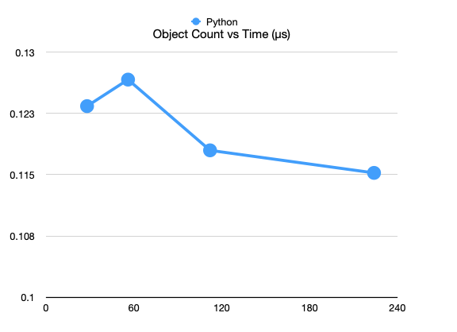
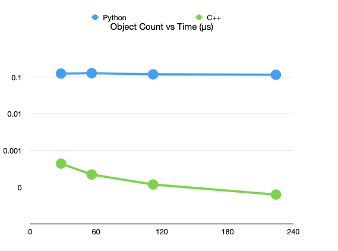
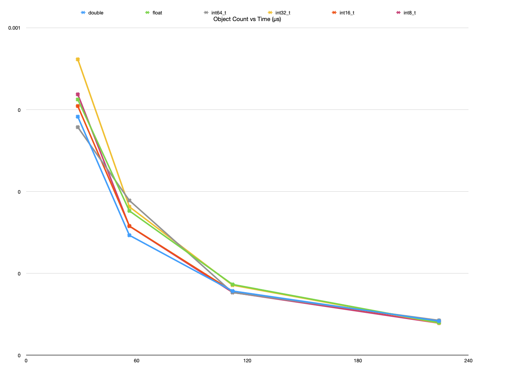

a) I used 28,56,112,224 as my object count parameters as suggested by the instructions. 

I chose 10,000 as iterations/game turns parameter as I needed a high enough number to rule out statistical noise and that was the number that started to add a noticable lag when running the program.




b)

This time with a logarithmic y-axis. I kept parameters fixed for a proper comparison. The C++ code is 3-4x orders of magnitude faster.



c)

Used `main.cpp` for double, `float.cpp` for float, `int64.cpp` for int64_t, int32_t, and int16_t (used find and replace to swap types), and `int8.cpp` for int8_t.



Upon running the different parameters in terminal I copied them into a spreadsheet (`A2.numbers`); also exported to `A2.csv` for convenience.


All tested data types had a wider spread with a lower object count, but converged around the same point with the max object count of 224.


```sh
~/CLionProjects/CS389/A2 Galaxy Explorers master*
❯ python update_locations.py 28 10000
Mean time per coordinate: 0.12339687507067408us
Final checksum is: -59738.67132790007
svmem(total=34359738368, available=6738526208, percent=80.4, used=9497919488, free=61964288, active=6688178176, inactive=6647365632, wired=2809741312)

~/CLionProjects/CS389/A2 Galaxy Explorers master*
❯ python update_locations.py 56 10000
Mean time per coordinate: 0.12664404826604628us
Final checksum is: 41070.751767567046
svmem(total=34359738368, available=6726434816, percent=80.4, used=9537470464, free=62177280, active=6677823488, inactive=6653804544, wired=2859646976)

~/CLionProjects/CS389/A2 Galaxy Explorers master*
❯ python update_locations.py 112 10000
Mean time per coordinate: 0.11798493303233824us
Final checksum is: 115118.04266155532
svmem(total=34359738368, available=6720290816, percent=80.4, used=9512747008, free=80510976, active=6656704512, inactive=6626131968, wired=2856042496)

~/CLionProjects/CS389/A2 Galaxy Explorers master*
❯ python update_locations.py 224 10000
Mean time per coordinate: 0.11522377231553296us
Final checksum is: -36624.59717058417
svmem(total=34359738368, available=6732349440, percent=80.4, used=9509666816, free=65175552, active=6681853952, inactive=6650560512, wired=2827812864)
```

